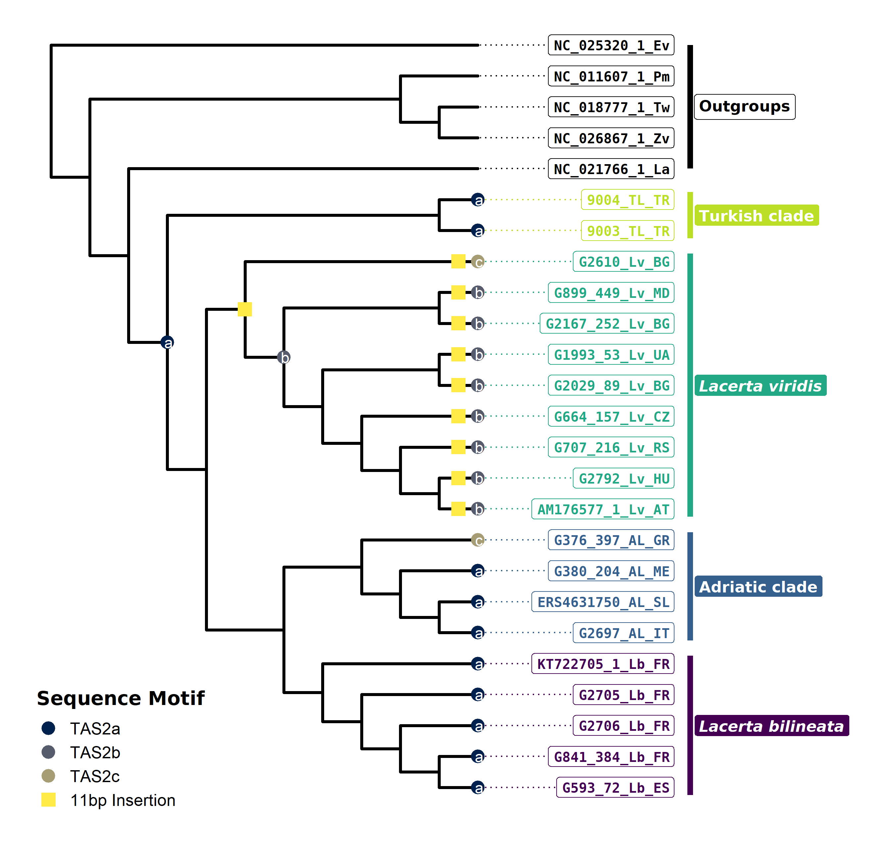

Tree and tree to map
================

## Load Data

First we load the required packages and files.

Note that I use a cladogram which I manually constructed with FigTree.
The coordinates for the Outgroups are just fake numbers (coordinates for
a lake in Turkmenistan) so they align nicely next to our samples.

``` r
rm(list = ls())

library(phytools)
library(ggplot2)
library(mapdata)
library(viridis)
library(ggtree)
library(extrafont)
library(cowplot)
library(ggpubr)

Nt_Tree = read.tree("../00_Data/Trees/RAxML_Nucleotide_with_rRNA_tRNA_Cladogram2.nwk")

Coordinates = as.matrix(read.csv("../00_Data/Miscellaneous/Coordinates2.csv", sep = "\t", header = T, row.names = 1))
```

# Plot phylogeny projected on a map

## Build PhyloToMap object

The xlim and ylim are roughly the border coordinates for Europe. Then we
build a color vector based on the lineage (Turkey, viridis, bilineata,
Adriatic, outgroup).

``` r
obj = phylo.to.map(Nt_Tree, 
                   Coordinates, 
                   xlim = c(-10, 59), 
                   ylim = c(30, 71),
                   fill = T, 
                   col = "moccasin",
                   plot=F, 
                   rotate = T, 
                   direction = "downwards", 
                   asp = 1)

colo = rep("x", length(Nt_Tree$tip.label))
for (i in seq(1:length(Nt_Tree$tip.label))){
  if (grepl("TL", Nt_Tree$tip.label[i])){
    colo[i] = viridis(4, end = 0.9)[4]
  } else if (grepl("Lv", Nt_Tree$tip.label[i])) {
    colo[i] = viridis(4, end = 0.9)[3]
  } else if (grepl("Lb", Nt_Tree$tip.label[i])) {
    colo[i] = viridis(4, end = 0.9)[1]
  } else if (grepl("AL", Nt_Tree$tip.label[i])) {
    colo[i] = viridis(4, end = 0.9)[2]
  } else {
    colo[i] = NA_character_
  }
}
cols = setNames(colo, Nt_Tree$tip.label)
```

## Plot Phylo to Map

Next we plot the object and save it as a PDF, because in the default
plot window it looks quite weird.

``` r
pdf(file="TreetoMap.pdf") 
plot(obj, 
     type = "phylogram", 
     direction = "downwards", 
     colors = cols, 
     fill = T, 
     col = "moccasin", 
     cex.points = c(1.1, 1), 
     lwd = 1.2, 
     bg = "darkblue", 
     xlim = c(-10, 59), 
     ylim = c(30, 71)) 
invisible(dev.off())
```

<!-- -->

## Align labels

Thats already very nice, but let’s try aligning the tip labels manually.
So first we check which label is the longest, and for the shorter labels
we paste “·” as many times as required so that in the end all labels
have the same number of characters.

``` r
obj_aligned = obj

# get the longest label
MaxLabelLength = max(nchar(obj$tree$tip.label))

# now loop over the labels and append "·" 
for (i in (seq(1:length(obj$tree$tip.label)))){
  if (nchar(obj$tree$tip.label[i]) != MaxLabelLength){
    dash = paste0(rep("-", each = MaxLabelLength-nchar(obj$tree$tip.label[i])), collapse = "")
    obj_aligned$tree$tip.label[i] = paste0(dash, obj$tree$tip.label[i])
  }
}

for (i in (seq(1:length(rownames(obj$coords))))){
  if (nchar(rownames(obj$coords)[i]) != MaxLabelLength){
    dash = paste0(rep("-", each = MaxLabelLength-nchar(rownames(obj$coords)[i])), collapse = "")
    rownames(obj_aligned$coords)[i] = paste0(dash, rownames(obj$coords)[i])
  }
}

#  now assign the colors to the new names
colo_aligned = rep("x", length(obj_aligned$tree$tip.label))
for (i in seq(1:length(obj_aligned$tree$tip.label))){
  if (grepl("TL", obj_aligned$tree$tip.label[i])){
    colo_aligned[i] = viridis(4, end = 0.9)[4]
  } else if (grepl("Lv", obj_aligned$tree$tip.label[i])) {
    colo_aligned[i] = viridis(4, end = 0.9)[3]
  } else if (grepl("Lb", obj_aligned$tree$tip.label[i])) {
    colo_aligned[i] = viridis(4, end = 0.9)[1]
  } else if (grepl("AL", obj_aligned$tree$tip.label[i])) {
    colo_aligned[i] = viridis(4, end = 0.9)[2]
  } else {
    colo_aligned[i] = NA_character_
  }
}
cols_aligned = setNames(colo_aligned, obj_aligned$tree$tip.label)
```

## Plot with aligned labels

``` r
path = ifelse(grepl(":", getwd()), 
              "C:/Users/RJaus/AppData/Local/Microsoft/Windows/Fonts/", 
              "NULL")
if(path == "NULL") path <- NULL else path <- path
font_import(paths = path, prompt = F, pattern = "DejaVuSans")
loadfonts()
#pdf(file="TreetoMap_alignedLabels.pdf", family = "DejaVu Sans Mono")
png(file="TreetoMap_alignedLabels.png", family = "DejaVu Sans Mono", res = 300, width = 18, height = 16, units = "cm")
plot(obj_aligned, 
     type = "phylogram", 
     direction = "downwards", 
     colors = cols_aligned, 
     ftype = "b", 
     cex.points = c(1.2, 1.3), 
     cex.text = 1.2,
     lwd = 3)
par(family = "DejaVu Sans")
legend(43.5, 63, legend = c(expression(italic("bilineata")), "Adriatic",
                          expression(italic("viridis")), 
                          "Turkish", "Outgroups"), 
       pt.bg = c(viridis(4, end = 0.9), "white"),
       col = "black", 
       title = expression(bold(bolditalic("Lacerta")*" clades")),
       bg = "grey85", pch = 21)
invisible(dev.off())
```

<!-- -->

# Plot phylogram with `ggtree`

## Load tree

Now we use `ggplot` and `ggtree` to plot just the tree, with bootstrap
support given by colored node points.

``` r
Nt_Tree_phylo = read.tree("../00_Data/Trees/RAxML_Nucleotide_with_rRNA_tRNA_Phylogram2.nwk")

# sort tip labels so they are in the same order as in the phylo.to.map object
Nt_Tree_phylo = ape::rotateConstr(Nt_Tree_phylo, rev(obj$tree$tip.label))


colo[is.na(colo)] = "black"
Nt_Tree_phylo$node.label2 = Nt_Tree_phylo$node.label
Nt_Tree_phylo$node.label2 = ifelse(Nt_Tree_phylo$node.label2 == "100",
                                   "*", Nt_Tree_phylo$node.label2)

g = ggtree(Nt_Tree_phylo, size = 1.1) + 
  geom_tiplab(align = T, hjust = 1, linetype = "dotted", 
              fontface = "bold", offset = 0.2, 
              geom = "label", color = colo, fill = "white", 
              family = "DejaVu Sans Mono", size = 4) + 
  geom_nodepoint(aes(color = as.numeric(label)), size = 5.5) + 
  #geom_nodelab(aes(subset = label < 100), 
  #             hjust = 0.6, 
  #             color = "white") +
  geom_text2(aes(label=label, subset = !is.na(as.numeric(label)) & as.numeric(label) < 100), color = "white") +
  scale_color_viridis_c(option = "cividis", limits = c(0, 100), 
                        direction = -1, name = "Bootstrap\nSupport", 
                        na.value = NA) +
  geom_cladelabel(node = 48, extend = 1, 
                  label = expression(bold("Outgroups")), align = T, 
                  geom = "label", fill = "white", 
                  offset = 0.25, barsize = 2, 
                  family = "DejaVu Sans") +
  geom_cladelabel(node = 30, extend = 0.25, 
                  label = expression(bold("Turkish clade")), 
                  align = T, 
                  geom = "label", fill = viridis(4, end = 0.9)[4], 
                  color = c(viridis(4, end = 0.9)[4], "white"), 
                  offset = 0.25, parse = T, barsize = 2, 
                  family = "DejaVu Sans") + 
  geom_cladelabel(node = 40, extend = 0.25, 
                  label = 'bolditalic("Lacerta viridis")', align = T, 
                  geom = "label", fill = viridis(4, end = 0.9)[3], 
                  color = c(viridis(4, end = 0.9)[3], "white"), 
                  offset = 0.25, parse = T, barsize = 2, 
                  family = "DejaVu Sans") + 
  geom_cladelabel(node = 37, extend = 0.25, 
                  label = expression(bold("Adriatic clade")), align = T, 
                  geom = "label", fill = viridis(4, end = 0.9)[2], 
                  color = c(viridis(4, end = 0.9)[2], "white"), 
                  offset = 0.25, barsize = 2, 
                  family = "DejaVu Sans") + 
  geom_cladelabel(node = 33, extend = 0.25, 
                  label = 'bolditalic("Lacerta bilineata")', align = T, 
                  geom = "label", fill = viridis(4, end = 0.9)[1], 
                  color = c(viridis(4, end = 0.9)[1], "white"), 
                  offset = 0.25, parse = T, barsize = 2, 
                  family = "DejaVu Sans") + 
  xlim(c(-0.05, 1.15)) +
  scale_y_reverse()  + 
  theme_tree() +
  theme(legend.position = c(0.2, 0.4), 
        legend.text = element_text(size = 14), 
        legend.title = element_text(face = "bold", size = 16, 
                  family = "DejaVu Sans")) +
  geom_treescale(x = 0, y = -7.5, width = 0.1) + 
  annotate("text", x = 0, y = 23.2, 
           label = expression(bold("Note on sample labels\n(excl. Outgroups):")), 
           parse = T, hjust = 0, family = "DejaVu Sans", size = 4) + 
  annotate("label", x = 0, y = 24.6, 
           label = expression(paste(atop("9004" , 1), atop("_TL" , 2), atop("_TR" , 3))), 
           parse = T, hjust = 0, family = "DejaVu Sans Mono", size = 4) + 
  annotate("text", x = 0, y = 27.5, 
           label = "1: Genbank/Tissuecollection ID\n2: Clade (Lb bilineata, Lv viridis, AL adriatic, TL Turkish)\n3: ISO Country Code", 
           hjust = 0, family = "DejaVu Sans", size = 4)


ggsave(plot = g, filename = "Tree.pdf", device = cairo_pdf, 
       width = 18, height = 18, dpi = 300, units = "cm")
ggsave(plot = g, filename = "Tree.png", device = "png", 
       width = 18, height = 18, dpi = 300, units = "cm")
ggsave(plot = g, filename = "Tree.jpeg", device = "jpeg", 
       width = 18, height = 18, dpi = 300, units = "cm")
ggsave(plot = g, filename = "Tree.tiff", device = "tiff", 
       width = 18, height = 18, dpi = 300, units = "cm", 
       compression = "lzw")

g
```

<!-- -->

## Plot Bayes Tree

Now we do the same for the tree calculated with MrBayes.

``` r
Bayes_Tree_phylo = read.tree("../00_Data/Trees/MrBayes_Nucleotide_Phylogram2.nwk")
Bayes_Tree_clado = read.tree("../00_Data/Trees/MrBayes_Nucleotide_Cladogram2.nwk")

# sort tip labels so they are in the same order as in the phylo.to.map object
Bayes_Tree_phylo = ape::rotateConstr(Bayes_Tree_phylo,
                                     rev(obj$tree$tip.label))
Bayes_Tree_clado = ape::rotateConstr(Bayes_Tree_clado,
                                     rev(obj$tree$tip.label))

colo_Bayes = rep("x", length(Bayes_Tree_phylo$tip.label))
for (i in seq(1:length(Bayes_Tree_phylo$tip.label))){
  if (grepl("TL", Bayes_Tree_phylo$tip.label[i])){
    colo_Bayes[i] = viridis(4, end = 0.9)[4]
  } else if (grepl("Lv", Bayes_Tree_phylo$tip.label[i])) {
    colo_Bayes[i] = viridis(4, end = 0.9)[3]
  } else if (grepl("Lb", Bayes_Tree_phylo$tip.label[i])) {
    colo_Bayes[i] = viridis(4, end = 0.9)[1]
  } else if (grepl("AL", Bayes_Tree_phylo$tip.label[i])) {
    colo_Bayes[i] = viridis(4, end = 0.9)[2]
  } else {
    colo_Bayes[i] = NA_character_
  }
}
colo_Bayes[is.na(colo_Bayes)] = "black"

q <- ggtree(Bayes_Tree_phylo)
d <- q$data
d <- d[!d$isTip,]
d$label <- round(as.numeric(d$label), digits = 2)
d <- d[d$label < 1,]
d$label = gsub("0", "", d$label)

g_Bayes = ggtree(Bayes_Tree_phylo, size = 1.1) + 
  geom_tiplab(align = T, hjust = 1, linetype = "dotted", 
              fontface = "bold", offset = 0.2, 
              geom = "label", color = colo_Bayes, fill = "white", 
              family = "DejaVu Sans Mono", size = 4.5) + 
  geom_nodepoint(aes(color = as.numeric(label)), size = 4.5) + 
  geom_text2(data = d, aes(label=label, subset = !is.na(as.numeric(label)) & as.numeric(label) < 1), color = "white", size = 2) +
  scale_color_viridis_c(option = "cividis", limits = c(0, 1), 
                        direction = -1, name = "Posterior\nProbability", 
                        na.value = NA) +
  geom_cladelabel(node = 28, extend = 1, 
                  label = expression(bold("Outgroups")), align = T, 
                  geom = "label", fill = "white", 
                  offset = 0.3, barsize = 2, 
                  family = "DejaVu Sans") +
  geom_cladelabel(node = 46, extend = 0.5, 
                  label = expression(bold("Turkish clade")), 
                  align = T, 
                  geom = "label", fill = viridis(4, end = 0.9)[4], 
                  color = c(viridis(4, end = 0.9)[4], "white"), 
                  offset = 0.3, parse = T, barsize = 2, 
                  family = "DejaVu Sans") + 
  geom_cladelabel(node = 33, extend = 0.25, 
                  label = 'bolditalic("Lacerta viridis")', align = T, 
                  geom = "label", fill = viridis(4, end = 0.9)[3], 
                  color = c(viridis(4, end = 0.9)[3], "white"), 
                  offset = 0.3, parse = T, barsize = 2, 
                  family = "DejaVu Sans") + 
  geom_cladelabel(node = 16, extend = 1.5, 
                  label = expression(bold("Adriatic clade")), align = T, 
                  geom = "label", fill = viridis(4, end = 0.9)[2], 
                  color = c(viridis(4, end = 0.9)[2], "white"), 
                  offset = 0.3, barsize = 2, 
                  family = "DejaVu Sans") + 
  geom_cladelabel(node = 42, extend = 1, 
                  label = 'bolditalic("Lacerta bilineata")', align = T, 
                  geom = "label", fill = viridis(4, end = 0.9)[1], 
                  color = c(viridis(4, end = 0.9)[1], "white"), 
                  offset = 0.3, parse = T, barsize = 2, 
                  family = "DejaVu Sans") + 
  xlim(c(-0.05, 1)) +
  scale_y_reverse()  + 
  theme_tree() +
  theme(legend.position = c(0.1, 0.4), 
        legend.text = element_text(size = 16), 
        legend.title = element_text(face = "bold", size = 18, 
                  family = "DejaVu Sans")) +
  geom_treescale(x = 0, y = -7.5, width = 0.1)


ggsave(plot = g_Bayes, filename = "BayesTree.pdf", device = cairo_pdf, 
       width = 18, height = 18, dpi = 300, units = "cm")
ggsave(plot = g_Bayes, filename = "BayesTree.png", device = "png", 
       width = 18, height = 18, dpi = 300, units = "cm")
ggsave(plot = g_Bayes, filename = "BayesTree.jpeg", device = "jpeg", 
       width = 18, height = 18, dpi = 300, units = "cm")
ggsave(plot = g_Bayes, filename = "BayesTree.tiff", device = "tiff", 
       width = 18, height = 18, dpi = 300, units = "cm", 
       compression = "lzw")

g_Bayes_clado = ggtree(Bayes_Tree_clado, size = 1.1) + 
  geom_tiplab(align = T, hjust = 1, linetype = "dotted", 
              fontface = "bold", offset = 5, 
              geom = "label", color = colo_Bayes, fill = "white", 
              family = "DejaVu Sans Mono", size = 4.5) + 
  geom_nodepoint(aes(color = as.numeric(label)), 
                 size = 4.5, show.legend = F) + 
  geom_text2(aes(label=label, subset = !is.na(as.numeric(label)) & as.numeric(label) < 1), color = "white", size = 2) +
  scale_color_viridis_c(option = "cividis", limits = c(0, 1), 
                        direction = -1, name = "Posterior\nProbability", 
                        na.value = NA) +
  geom_cladelabel(node = 28, extend = 1, 
                  label = expression(bold("Outgroups")), align = T, 
                  geom = "label", fill = "white", 
                  offset = 5.3, barsize = 2, 
                  family = "DejaVu Sans") +
  geom_cladelabel(node = 46, extend = 0.5, 
                  label = expression(bold("Turkish clade")), 
                  align = T, 
                  geom = "label", fill = viridis(4, end = 0.9)[4], 
                  color = c(viridis(4, end = 0.9)[4], "white"), 
                  offset = 5.3, parse = T, barsize = 2, 
                  family = "DejaVu Sans") + 
  geom_cladelabel(node = 33, extend = 0.25, 
                  label = 'bolditalic("Lacerta viridis")', align = T, 
                  geom = "label", fill = viridis(4, end = 0.9)[3], 
                  color = c(viridis(4, end = 0.9)[3], "white"), 
                  offset = 5.3, parse = T, barsize = 2, 
                  family = "DejaVu Sans") + 
  geom_cladelabel(node = 16, extend = 1.5, 
                  label = expression(bold("Adriatic clade")), align = T, 
                  geom = "label", fill = viridis(4, end = 0.9)[2], 
                  color = c(viridis(4, end = 0.9)[2], "white"), 
                  offset = 5.3, barsize = 2, 
                  family = "DejaVu Sans") + 
  geom_cladelabel(node = 42, extend = 1, 
                  label = 'bolditalic("Lacerta bilineata")', align = T, 
                  geom = "label", fill = viridis(4, end = 0.9)[1], 
                  color = c(viridis(4, end = 0.9)[1], "white"), 
                  offset = 5.3, parse = T, barsize = 2, 
                  family = "DejaVu Sans") + 
  xlim(c(-0.05, 20.25)) +
  scale_y_reverse()  + 
  theme_tree()

ggsave(plot = g_Bayes_clado, filename = "BayesTreeClado.pdf", device = cairo_pdf, 
       width = 18, height = 18, dpi = 300, units = "cm")
ggsave(plot = g_Bayes_clado, filename = "BayesTreeClado.png", device = "png", 
       width = 18, height = 18, dpi = 300, units = "cm")
ggsave(plot = g_Bayes_clado, filename = "BayesTreeClado.jpeg", device = "jpeg", 
       width = 18, height = 18, dpi = 300, units = "cm")
ggsave(plot = g_Bayes_clado, filename = "BayesTreeClado.tiff", device = "tiff", 
       width = 18, height = 18, dpi = 300, units = "cm", 
       compression = "lzw")
```

## Combine Tree and Phylo to Map

We can plot the tree and the phylomap next to each other by assigning a
function to the r base plot and then use this within the `plot_grid`
function.

``` r
PhyloMap = function(){
par(family = "DejaVu Sans Mono")
plot(obj_aligned, 
     type = "phylogram", 
     direction = "downwards", 
     colors = cols_aligned, 
     ftype = "b", 
     cex.points = c(1.2, 1.3), 
     lwd = 3)
par(family = "DejaVu Sans")
legend(43.5, 63, legend = c(expression(italic("bilineata")), "Adriatic",
                          expression(italic("viridis")), 
                          "Turkish", "Outgroups"), 
       pt.bg = c(viridis(4, end = 0.9), "white"),
       col = "black", 
       title = expression(bold("Lacerta lineages")),
       bg = "grey85", pch = 21)
}

combi = plot_grid(g, PhyloMap, labels = "AUTO", 
                  nrow = 1, ncol = 2, 
                  label_size = 18, label_fontfamily = "DejaVu Sans", 
                  vjust = 3)


ggsave(plot = combi, filename = "Tree_PhyloToMap_Combined.pdf", 
       device = cairo_pdf, width = 16, height = 9, 
       dpi = 600)
ggsave(plot = combi, filename = "Tree_PhyloToMap_Combined.png", 
       device = "png", width = 16, height = 9, 
       dpi = 600)

combi
```

<!-- -->

# Pairwise Distance Heatmap

Plot the uncorrected p-distances as a Heatmap. The distance matrix was
generated with the program Geneious.

``` r
distmat = as.dist(read.csv("../00_Data/Miscellaneous/pDistanceMatrix2.csv", 
                           header = T, row.names = 1), 
                  diag = T, upper = T)

# Distances are here given as %identity, so we need to invert the values
# then we get the uncorrected p-distance in %
distmat = 100-distmat

# get the tip labels and sort by their y value
# this will be used to sort the distance matrix in the same way
Labels = as.data.frame(cbind(g$data[g$data$isTip == T,]$label,
                             as.numeric(g$data[g$data$isTip == T,]$y)), 
                       stringsAsFactors = F)
Labels$V2 = as.numeric(Labels$V2)
Labels = Labels[order(Labels$V2, decreasing = T),]
distmat = as.matrix(distmat)[Labels$V1, Labels$V1]

distmat_melted = reshape2::melt(as.matrix(distmat))
distmat_melted$value = ifelse(distmat_melted$Var1 == distmat_melted$Var2, 
                              NA, distmat_melted$value)
distmat_melted$HeatmapValue = ifelse(distmat_melted$value > 8.5, 
                                     8.5, distmat_melted$value)

# get rectangle positions for each lineage
rectdata = data.frame(Clade = c("Lacerta viridis", 
                                    "Turkish clade", 
                                    "Lacerta bilineata", 
                                    "Adriatic clade", 
                                    "Outgroups"), 
                      xminval = 0, xmaxval = 0, 
                      yminval = 0, ymaxval = 0)

rectdata[rectdata$Clade == "Lacerta viridis", "xminval"] = min(which(grepl("Lv_", head(distmat_melted, n = 25)$Var1, perl = T)))-0.5
rectdata[rectdata$Clade == "Lacerta viridis", "xmaxval"] = max(which(grepl("Lv_", head(distmat_melted, n = 25)$Var1, perl = T)))+0.5

rectdata[rectdata$Clade == "Turkish clade", "xminval"] = min(which(grepl("TL_", head(distmat_melted, n = 25)$Var1, perl = T)))-0.5
rectdata[rectdata$Clade == "Turkish clade", "xmaxval"] = max(which(grepl("TL_", head(distmat_melted, n = 25)$Var1, perl = T)))+0.5

rectdata[rectdata$Clade == "Lacerta bilineata", "xminval"] = min(which(grepl("Lb_", head(distmat_melted, n = 25)$Var1, perl = T)))-0.5
rectdata[rectdata$Clade == "Lacerta bilineata", "xmaxval"] = max(which(grepl("Lb_", head(distmat_melted, n = 25)$Var1, perl = T)))+0.5

rectdata[rectdata$Clade == "Adriatic clade", "xminval"] = min(which(grepl("AL_", head(distmat_melted, n = 25)$Var1, perl = T)))-0.5
rectdata[rectdata$Clade == "Adriatic clade", "xmaxval"] = max(which(grepl("AL_", head(distmat_melted, n = 25)$Var1, perl = T)))+0.5

rectdata[rectdata$Clade == "Outgroups", "xminval"] = min(which(grepl("[KN]C", head(distmat_melted, n = 25)$Var1, perl = T)))-0.5
rectdata[rectdata$Clade == "Outgroups", "xmaxval"] = max(which(grepl("[KN]C", head(distmat_melted, n = 25)$Var1, perl = T)))+0.5

rectdata$yminval = rectdata$xminval
rectdata$ymaxval = rectdata$xmaxval

d = ggplot(distmat_melted) + 
  geom_raster(aes(x = Var1, y = Var2, fill = HeatmapValue)) + 
  # uncomment these lines if you want to include the distance given in % per tile
  #geom_text(aes(x = Var2, y = Var1, 
  #              label = ifelse(is.na(value), "", 
  #                             ifelse(value <= 10, 
  #                                    sprintf("%0.2f", round(value, digits = 2)), 
  #                                    sprintf("%0.1f", round(value, digits = 1))))), 
  #          color = ifelse(distmat_melted$value >= 1, "white", "black"), 
  #          size = 2.5, na.rm = T) +
  geom_rect(data = rectdata, aes(xmin = xminval, xmax = xmaxval, 
                                 ymin = yminval, ymax = ymaxval, 
                                 color = Clade), 
            fill = NA, size = 2) +
  scale_fill_viridis(option = "cividis", na.value = "white", direction = -1, 
                     breaks = seq(0, 8, by = 2), 
                     labels = c(0, 2, 4, 6, ">8"), 
                     name = "Uncorrected\np distance (%)") +
  scale_color_manual(limits = c("Outgroups", "Turkish clade", 
                                "Lacerta viridis", 
                                "Adriatic clade", 
                                "Lacerta bilineata"),
                     labels = c("Outgroups", "Turkish clade", 
                                expression(italic("Lacerta viridis")), 
                                "Adriatic clade", 
                                expression(italic("Lacerta bilineata"))), 
                     values = c("black", 
                                viridis(4, end = 0.9, direction = -1))) +
  theme(axis.title = element_blank(),
        axis.text.x = element_text(angle = 90, hjust = 1), 
        axis.text = element_text(size = 12, 
                                 family = "DejaVu Sans Mono", 
                                 face = "bold"), 
        legend.text = element_text(size = 12, family = "DejaVu Sans"), 
        legend.title = element_text(size = 14, face = "bold", 
                                    family = "DejaVu Sans"), 
        panel.background = element_blank(), 
        panel.grid = element_blank()) + 
  coord_equal()


ggsave(plot = d, filename = "Uncorrected-p-Distance_Heatmap.pdf", 
       device = cairo_pdf, width = 18, height = 13, dpi = 300, units = "cm")
ggsave(plot = d, filename = "Uncorrected-p-Distance_Heatmap.png", 
       device = "png", width = 18, height = 13, dpi = 300, units = "cm")
ggsave(plot = d, filename = "Uncorrected-p-Distance_Heatmap.jpeg", 
       device = "jpeg", width = 18, height = 13, dpi = 300, units = "cm")
ggsave(plot = d, filename = "Uncorrected-p-Distance_Heatmap.tiff", 
       device = "tiff", width = 18, height = 13, dpi = 300, units = "cm", 
       compression = "lzw")

d
```

<!-- -->

# Control Region Visualisation

This visualisation will be a stacked bar chart to outline the structure
of the mt control region adapted from [Böhme et
al. 2007](https://doi.org/10.1016/j.gene.2007.02.006).

``` r
CRdata = as.data.frame(read.csv("../00_Data/Miscellaneous/DummyDataControlRegion.csv", header = T, 
                                stringsAsFactors = F))

CRdata$xmin = 0
CRdata$xmax = 1
CRdata$ymin = 0
CRdata$ymax = 0

for(i in seq(1:nrow(CRdata))){
  if(i == 1){
    CRdata[i, "ymin"] = 0
    CRdata[i, "ymax"] = CRdata[i, "Height"]}
  else {
    CRdata[i, "ymin"] = CRdata[i-1, "ymax"]
    CRdata[i, "ymax"] = CRdata[i-1, "ymax"] + CRdata[i, "Height"]
  }
}

c = ggplot(CRdata, aes(xmin = xmin, ymin = ymin, 
                   xmax = xmax, ymax = ymax, 
                   fill = Group)) + 
  geom_rect() + 
  geom_text(aes(x = (xmin+xmax)/2, y = (ymin+ymax)/2, 
                label = Label), 
            na.rm = T, angle = 90, 
            color = "white", fontface = "bold", family = "DejaVu Sans", 
            size = 2.7) +
  geom_rect(xmin = 0, xmax = 1, ymin = 0, ymax = 100, 
            color = "black", fill = NA, size = 1.5) +
  scale_fill_viridis_d(option = "cividis", na.value = "white", 
                       begin = 0.1, end = 0.8, name = "Feature", 
                       na.translate = F) +
  theme_void() + 
  coord_flip() +
  theme(legend.title = element_text(face = "bold", size = 10, 
                                    family = "DejaVu Sans"), 
        legend.text = element_text(size = 8, family = "DejaVu Sans"), 
        aspect.ratio = 0.3, 
        legend.position = "right")

ggsave(plot = c, filename = "SchematicOverwiev_Controlregion.pdf", 
       device = cairo_pdf, width = 18, height = 6, dpi = 300, units = "cm")
ggsave(plot = c, filename = "SchematicOverwiev_Controlregion.png", 
       device = "png", width = 18, height = 6, dpi = 300, units = "cm")
ggsave(plot = c, filename = "SchematicOverwiev_Controlregion.jpeg", 
       device = "jpeg", width = 18, height = 6, dpi = 300, units = "cm")
ggsave(plot = c, filename = "SchematicOverwiev_Controlregion.tiff", 
       device = "tiff", width = 18, height = 6, dpi = 300, units = "cm", compression = "lzw")

c
```

<!-- -->

# Motif Evolution

This section covers the plotting of the sequence motiv evolution on the
cladogram.

``` r
Nt_Tree = ape::rotateConstr(Nt_Tree, rev(obj$tree$tip.label))

t = ggtree(Nt_Tree, size = 1.1) + 
  geom_tiplab(align = T, hjust = 1, linetype = "dotted", 
              fontface = "bold", offset = 5, 
              geom = "label", color = colo, fill = "white", 
              family = "DejaVu Sans Mono", size = 3.5) + 
  scale_color_viridis_c(option = "cividis", limits = c(0, 100), 
                        direction = -1, name = "Bootstrap Support", 
                        na.value = NA) +
  geom_cladelabel(node = 48, extend = 1, 
                  label = expression(bold("Outgroups")), align = T, 
                  geom = "label", fill = "white", 
                  offset = 5.25, barsize = 2, 
                  family = "DejaVu Sans") +
  geom_cladelabel(node = 30, extend = 0.25, 
                  label = expression(bold("Turkish clade")), 
                  align = T, 
                  geom = "label", fill = viridis(4, end = 0.9)[4], 
                  color = c(viridis(4, end = 0.9)[4], "white"), 
                  offset = 5.25, parse = T, barsize = 2, 
                  family = "DejaVu Sans") + 
  geom_cladelabel(node = 40, extend = 0.25, 
                  label = 'bolditalic("Lacerta viridis")', align = T, 
                  geom = "label", fill = viridis(4, end = 0.9)[3], 
                  color = c(viridis(4, end = 0.9)[3], "white"), 
                  offset = 5.25, parse = T, barsize = 2, 
                  family = "DejaVu Sans") + 
  geom_cladelabel(node = 37, extend = 0.25, 
                  label = expression(bold("Adriatic clade")), align = T, 
                  geom = "label", fill = viridis(4, end = 0.9)[2], 
                  color = c(viridis(4, end = 0.9)[2], "white"), 
                  offset = 5.25, barsize = 2, 
                  family = "DejaVu Sans") + 
  geom_cladelabel(node = 33, extend = 0.25, 
                  label = 'bolditalic("Lacerta bilineata")', align = T, 
                  geom = "label", fill = viridis(4, end = 0.9)[1], 
                  color = c(viridis(4, end = 0.9)[1], "white"), 
                  offset = 5.25, parse = T, barsize = 2, 
                  family = "DejaVu Sans") + 
  scale_y_reverse()  + 
  theme_tree() 
  

# look at the nodepoints and add the annotation manually
# with the vectors we build now

TAS2a_tip = c(1:2, 3:7, 8:10)
TAS2a_node = 29
TAS2b_tip = 13:20
TAS2b_node = 41
TAS2c_tip = c(11, 12)
Insert_tip = 12:20
Insert_node = 40

tl = t +
  geom_tippoint(aes(subset = (node %in% TAS2a_tip), 
                    color = "TAS2a", 
                    shape = "TAS2a"), 
                size = 4.5)+
  geom_nodepoint(aes(subset = (node %in% TAS2a_node), 
                     color = "TAS2a", 
                     shape = "TAS2a"), 
                 size = 4.5)+
  geom_nodelab(aes(subset = (node %in% TAS2a_tip), label = "a"), 
               color = "white", hjust = 0.6) +
  geom_nodelab(aes(subset = (node %in% TAS2a_node), label = "a"), 
               color = "white", hjust = 0.6) +
  geom_tippoint(aes(subset = (node %in% TAS2b_tip), 
                    color = "TAS2b", 
                    shape = "TAS2b"), 
                size = 4.5)+
  geom_nodepoint(aes(subset = (node %in% TAS2b_node), 
                     color = "TAS2b", 
                     shape = "TAS2b"), 
                 size = 4.5)+
  geom_nodelab(aes(subset = (node %in% TAS2b_tip), label = "b"), 
               color = "white", hjust = 0.6) +
  geom_nodelab(aes(subset = (node %in% TAS2b_node), label = "b"), 
               color = "white", hjust = 0.6) +
  geom_tippoint(aes(subset = (node %in% TAS2c_tip), 
                    color = "TAS2c", 
                    shape = "TAS2c"), 
                size = 4.5)+ 
  geom_nodelab(aes(subset = (node %in% TAS2c_tip), label = "c"), 
               color = "white", hjust = 0.6) +
  geom_tippoint(aes(subset = (node %in% Insert_tip), 
                    color = "11bp Insertion", 
                    shape = "11bp Insertion"), 
                size = 4.5, 
                position = position_nudge(x = -0.5)) + 
  geom_nodepoint(aes(subset = (node %in% Insert_node), 
                     color = "11bp Insertion", 
                     shape = "11bp Insertion"), 
                 size = 4.5)+
  scale_color_manual(values = cividis(4, begin = 0, 
                                      end = 1, direction = 1), 
                     labels = c("TAS2a", "TAS2b", "TAS2c", "11bp Insertion"), 
                     breaks = c("TAS2a", "TAS2b", "TAS2c", "11bp Insertion"),
                     name = "Sequence Motif") +
  scale_shape_manual(values = c(16, 16, 16, 15), 
                     labels = c("TAS2a", "TAS2b", "TAS2c", "11bp Insertion"), 
                     breaks = c("TAS2a", "TAS2b", "TAS2c", "11bp Insertion"),
                     name = "Sequence Motif") +
  theme(legend.position = c(0.125, 0.1), 
        legend.text = element_text(size = 12), 
        legend.title = element_text(face = "bold", size = 14, 
                  family = "DejaVu Sans")) +
  xlim(c(0, 20.5))

ggsave(plot = tl, filename = "SequenceMotifEvolution.pdf", 
       device = cairo_pdf, width = 18, height = 16, dpi = 300, units = "cm")
ggsave(plot = tl, filename = "SequenceMotifEvolution.png", 
       device = "png", width = 18, height = 16, dpi = 300, units = "cm")
ggsave(plot = tl, filename = "SequenceMotifEvolution.jpeg", 
       device = "jpeg", width = 18, height = 16, dpi = 300, units = "cm")
ggsave(plot = tl, filename = "SequenceMotifEvolution.tiff", 
       device = "tiff", width = 18, height = 16, dpi = 300, units = "cm", 
       compression = "lzw")

tl  
```

<!-- -->

## Constrained Topologies

In this chunck we plot the previously analysed constrained topologies
and plot their significance next to it. This will later be a
Supplementary Figure

``` r
# read the schematic nwk files
unconstr = read.tree("../02_TopologyConstrainAnalysis/Unconstrained.nwk")
VirTurkConstr = read.tree("../02_TopologyConstrainAnalysis/ViridisTurkeyMonophylyConstrain.nwk")
VirAdriConstr = read.tree("../02_TopologyConstrainAnalysis/ViridisAdriaticMonophylyConstrain.nwk")

unconstr$tip.label = gsub("_", " ", unconstr$tip.label)
VirTurkConstr$tip.label = gsub("_", " ", VirTurkConstr$tip.label)
VirAdriConstr$tip.label = gsub("_", " ", VirAdriConstr$tip.label)

g_unconstr = ggtree(unconstr, size = 0.6) + 
  geom_tiplab(aes(fontface = ifelse(grepl("L\\.", label), "italic", "plain"))) + ggplot2::xlim(0, 10)
g_VirTurkConstr = ggtree(VirTurkConstr, size = 0.6) + 
  geom_tiplab(aes(fontface = ifelse(grepl("L\\.", label), "italic", "plain"))) + ggplot2::xlim(0, 10)
g_VirAdriConstr = ggtree(VirAdriConstr, size = 0.6) + 
  geom_tiplab(aes(fontface = ifelse(grepl("L\\.", label), "italic", "plain"))) + ggplot2::xlim(0, 10)

ConstrDataFrame = as.data.frame(read.csv("../02_TopologyConstrainAnalysis/ConstrainedDataframeForR.tsv", sep = "\t", header = T))
```

    ## Warning in read.table(file = file, header = header, sep = sep, quote
    ## = quote, : unvollstädige letzte Zeile von readTableHeader in '../
    ## 02_TopologyConstrainAnalysis/ConstrainedDataframeForR.tsv' gefunden

``` r
g_ConstrDF = ggtexttable(ConstrDataFrame, rows = NULL, 
                         theme = ttheme("blank", base_size = 11))

combiConstr = ggarrange(g_unconstr, g_VirTurkConstr, g_VirAdriConstr, 
                        ncol = 3, nrow = 1, labels = "AUTO")
combiConstrWithDF = ggarrange(combiConstr, g_ConstrDF, 
                              ncol = 1, nrow = 2)

ggsave(plot = combiConstrWithDF, filename = "ConstrainedTopologyScheme.pdf", 
       dpi = 300, device = "pdf", width = 18, height = 8, units = "cm")
ggsave(plot = combiConstrWithDF, filename = "ConstrainedTopologyScheme.png", 
       dpi = 300, device = "png", width = 18, height = 8, units = "cm")
ggsave(plot = combiConstrWithDF, filename = "ConstrainedTopologyScheme.jpeg", 
       dpi = 300, device = "jpeg", width = 18, height = 8, units = "cm")
ggsave(plot = combiConstrWithDF, filename = "ConstrainedTopologyScheme.tiff", 
       dpi = 300, device = "tiff", width = 18, height = 8, units = "cm", 
       compression = "lzw")

combiConstrWithDF
```

<!-- -->

## Gene saturation test

Here we plot the rate of transitions and transversions against the
genetic distance to estimate if our dataset might be saturated

``` r
library(ape)

Alignment = read.dna("../02_TopologyConstrainAnalysis/raxml_complete.fas", 
                       as.character = TRUE, format = "fasta", as.matrix = T)

# The alignment contains rRNA and tRNA, we use the partition file
# to exclude these non-coding genes
Partition = read.csv("../02_TopologyConstrainAnalysis/raxml_partition.txt", 
                     sep = " ", header = F)
Partition$Gene = Partition$V2
Partition$Start = gsub("-.*", "", Partition$V4)
Partition$End = gsub("[0-9]*-", "", Partition$V4)
Partition$Fragment = gsub("-", ":", Partition$V4)
Partition = subset(Partition, select = c("Gene", "Start", "End", "Fragment"))
Partition = Partition[1:13,]
A = data.frame(Gene = "All", Start = 1, 
               End = 11392, Fragment = paste0(1, ":", 11392))
Partition = rbind(A, Partition)

extract.sites = function(d, sites){
return(d[,sites])
}

for(gene in Partition$Gene){
  start = Partition[Partition$Gene == gene, "Start"]
  end = Partition[Partition$Gene == gene, "End"]
  gene_al = paste0(gene, "_alignment")
  assign(gene_al, 
         extract.sites(Alignment, sites = start:end))
}

Final_DF = data.frame(RawDistance = NULL, value = NULL, 
                      Type = NULL, Gene = NULL)

for(alignment in ls(pattern = "_alignment")){
  alignment_get = get(alignment)
  distdna = dist.dna(as.DNAbin(alignment_get), model="raw")
  distdna_TS = dist.dna(as.DNAbin(alignment_get), model="TS")
  distdna_TV = dist.dna(as.DNAbin(alignment_get), model="TV")
  
  distdnaDF = reshape2::melt(as.matrix(distdna))
  distdna_TSDF = reshape2::melt(as.matrix(distdna_TS))
  distdna_TVDF = reshape2::melt(as.matrix(distdna_TV))
  
  RawDistance = c(distdnaDF$value, distdnaDF$value)
  TS = distdna_TSDF$value
  TS = as.data.frame(TS)
  colnames(TS) = "value"
  TS$Type = "Transitions"
  TV = distdna_TVDF$value
  TV = as.data.frame(TV)
  colnames(TV) = "value"
  TV$Type = "Transversions"
  TSTV = rbind(TS, TV)
  
  DF = cbind(RawDistance, TSTV)
  DF$Gene = gsub("_alignment", "", alignment)
  
  Final_DF = rbind(Final_DF, DF)
}


g_TSTV = ggplot(Final_DF, aes(x = RawDistance, y = value, color = Type)) + 
  geom_point() + 
  geom_smooth(method = "glm") +
  labs(x = "Raw Genetic Distance", 
       y = "Transitions/Transversions") + 
  facet_wrap(facets = vars(Gene), scales = "free") + 
  theme(legend.position = c(0.8, 0.1))

ggsave(plot = g_TSTV, filename = "GeneSaturationTest.pdf", device = "pdf", 
       dpi = 300, width = 18, height = 18, units = "cm")
```

    ## `geom_smooth()` using formula 'y ~ x'

``` r
ggsave(plot = g_TSTV, filename = "GeneSaturationTest.png", device = "png", 
       dpi = 300, width = 18, height = 18, units = "cm")
```

    ## `geom_smooth()` using formula 'y ~ x'

``` r
ggsave(plot = g_TSTV, filename = "GeneSaturationTest.jpeg", device = "jpeg", 
       dpi = 300, width = 18, height = 18, units = "cm")
```

    ## `geom_smooth()` using formula 'y ~ x'

``` r
ggsave(plot = g_TSTV, filename = "GeneSaturationTest.tiff", device = "tiff", 
       dpi = 300, width = 18, height = 18, units = "cm", compression = "lzw")
```

    ## `geom_smooth()` using formula 'y ~ x'

``` r
g_TSTV
```

    ## `geom_smooth()` using formula 'y ~ x'

<!-- -->
